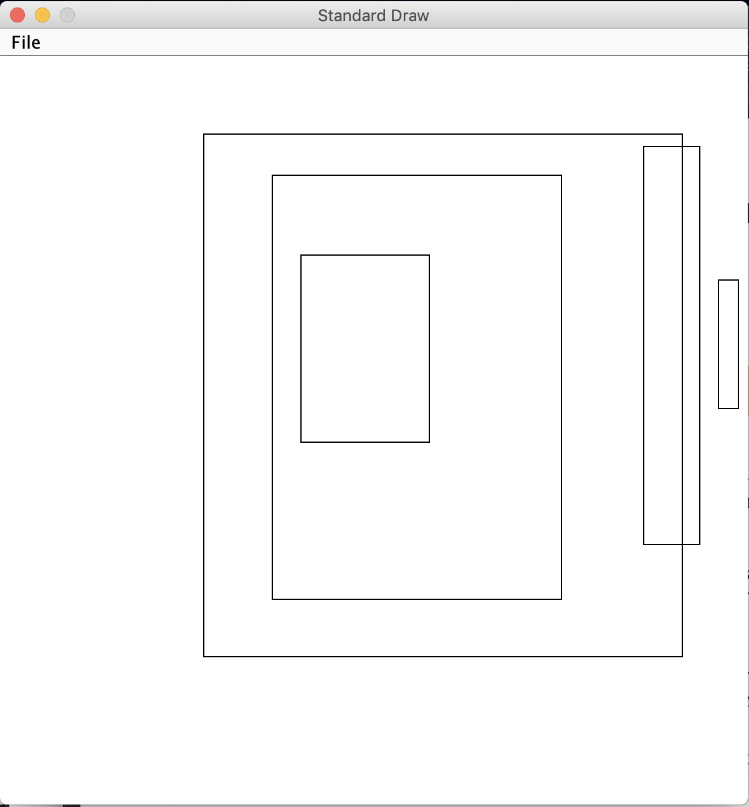

### 1.2.1 答案：
这一题比较简单，Point2D.java以及后面题目中出现的文件，可以去官网下载。https://algs4.cs.princeton.edu/12oop/  
答案中有两个关于计算最近距离的实现（minDist 和 minDist2），大家可以对比下区别。
```java
import edu.princeton.cs.algs4.*;

public class E1
{
  public static void main(String[] args) {
    StdDraw.setCanvasSize(600,400);
    StdDraw.setXscale(0, 1);
    StdDraw.setYscale(0, 1);
    StdDraw.setPenRadius(.02);
    StdDraw.setPenColor(StdDraw.RED);
    // 前面这几行只是了美观，如果不加这几行，Draw会使用默认的样式，点就很小，看不清。

    int n = Integer.parseInt(args[0]);

    Point2D[]  points = new Point2D[n];
    for (int i = 0; i < n; i++) {
      double x = StdRandom.random();
      double y = StdRandom.random();
      points[i] = new Point2D(x, y);
      points[i].draw();
    }

    double minDist = 2.0;
    for (int i = 0; i < n; i++)
      for (int j = 0; j < n; j++)
        if (i != j) {
          if (minDist > points[i].distanceTo(points[j]))
            minDist = points[i].distanceTo(points[j]);
      }
    StdOut.println(minDist);

    double minDist2 = 2.0;
    for (int i = 0; i < n - 1; i++)
      for (int j = i + 1; j < n; j++)
          if (minDist2 > points[i].distanceTo(points[j]))
            minDist2 = points[i].distanceTo(points[j]);
    StdOut.println(minDist2);
  }
}
/*
 Solution of 1.2.1
>>>java E1 5
0.1447928099410894
0.1447928099410894
*/

```


### 1.2.2 答案：
这一题和上一题的主要现实差不多，就是不用画出来。   
书中的API表中的相交的方法叫 intersect，官网的实现中叫 intersects，请读一遍 原文件IntervalD.java, Interval2D有同样问题，大家自己注意。  
Interval1D就像是数轴上的一段线段，有个地方需要注意：  
min 必须小于小于或等于 max，所以在随机创建的时候需要做大小判断。
```java
for (int i = 0; i < intervals.length; i++) {
  double temp1 = StdRandom.random() * 100;
  double temp2 = StdRandom.random() * 100;
  if (temp1 < temp2)  intervals[i] = new Interval1D(temp1, temp2);
  else                intervals[i] = new Interval1D(temp2, temp1);
}
```
完整实现如下：
```java
import edu.princeton.cs.algs4.*;

public class E2
{
  public static void main(String[] args) {
    int n = Integer.parseInt(args[0]);
    Interval1D[] intervals = new Interval1D[n];

    for (int i = 0; i < intervals.length; i++) {
      double temp1 = StdRandom.random() * 100;
      double temp2 = StdRandom.random() * 100;
      if (temp1 < temp2)  intervals[i] = new Interval1D(temp1, temp2);
      else                intervals[i] = new Interval1D(temp2, temp1);
    }

    StdOut.println("All Intervals: ");
    for (int i = 0; i < intervals.length; i++)
      StdOut.println(i + " : " + intervals[i]);
    StdOut.println();

    for (int i = 0; i < intervals.length - 1; i++)
      for (int j = i + 1; j < intervals.length; j++)
          if (intervals[i].intersects(intervals[j]))
            StdOut.println(i + " and " + j + " are intersects.");
  }
}
/*
 Solution of 1.2.1
>>>java java E2 3
All Intervals:
0 : [33.48579524983259, 36.95083286074507]
1 : [14.849275810849393, 59.54862058663627]
2 : [75.21421316244648, 88.2557709639555]

0 and 1 are intersects.
*/

```

### 1.2.3 答案：
这一题毕竟繁琐，一点一点来，先说创建n个Interval2D，需要先创建n x 2个 Interval1D，并且每个都随机生成。  
相交问题毕竟简答，Interval2D中提供了现成的方法。但是是否包含则没有现成的方法，这里我采用给Interval1D和Interval2D添加一个包含的方法来解决这个问题，毕竟简介一些。（否则写起来很麻烦，编程就是要复用代码）  
在Interval1D中添加：  
```java
public boolean contains(Interval1D that) {
    if (this.min > that.min) return false;
    if (this.max < that.max) return false;
    return true;
}
// this.min的比that.min更小，this.max比that.max更大
```
在Interval2D中添加：  
```java
public boolean contains(Interval2D that) {
    if (!this.x.contains(that.x)) return false;
    if (!this.y.contains(that.y)) return false;
    return true;
}
```
用例：
```java
import edu.princeton.cs.algs4.*;

public class E3 {
  public static void main(String[] args) {
    int n = Integer.parseInt(args[0]);
    double min = Double.parseDouble(args[1]);
    double max = Double.parseDouble(args[2]);

    StdDraw.setCanvasSize(600,600);
    StdDraw.setXscale(min, max);
    StdDraw.setYscale(min, max);

    Interval1D[] interval1Dx = new Interval1D[n];
    Interval1D[] interval1Dy = new Interval1D[n];
    Interval2D[] interval2Ds = new Interval2D[n];

    for (int i = 0; i < n; i++) {
      double x1 = StdRandom.uniform(min, max);
      double x2 = StdRandom.uniform(min, max);
      if (x1 < x2)  interval1Dx[i] = new Interval1D(x1, x2);
      else                interval1Dx[i] = new Interval1D(x2, x1);

      double y1 = StdRandom.uniform(min, max);
      double y2 = StdRandom.uniform(min, max);
      if (y1 < y2)  interval1Dy[i] = new Interval1D(y1, y2);
      else                interval1Dy[i] = new Interval1D(y2, y1);

      interval2Ds[i] = new Interval2D(interval1Dx[i], interval1Dy[i]);
      interval2Ds[i].draw();
      StdOut.println(i + " : " + interval2Ds[i]);
    }

    // intersects 判断，只需要i和j一次判断
    for (int i = 0; i < interval2Ds.length - 1; i++)
      for (int j = i + 1; j < interval2Ds.length; j++)
        if (interval2Ds[i].intersects(interval2Ds[j]))
          StdOut.println(i + " and " + j + " are intersects.");

    // contains 判断，判断完i是否包含j，还需要判断j是否包含i。
    for (int i = 0; i < interval2Ds.length; i++)
      for (int j = 0; j < interval2Ds.length; j++)
        if (i != j && interval2Ds[i].contains(interval2Ds[j]))
          StdOut.println(i + " and " + j + " are contains.");
  }
}
/*
Solution of 1.2.3
>>>java E3 5 0.0 1.0
0 : [0.4025333983820326, 0.5738137478797859] x [0.4839518957301133, 0.7345004377676841]
1 : [0.27304047970111145, 0.912072563545142] x [0.19722115262017026, 0.8959694565649969]
2 : [0.36403328392547407, 0.7506170393988534] x [0.2734091531669941, 0.8400333137051149]
3 : [0.9611237086771058, 0.9877038468535773] x [0.5285380202401169, 0.7008130571955506]
4 : [0.8615834999700394, 0.9362764895178624] x [0.3479004987562584, 0.8789003434984467]
0 and 1 are intersects.
0 and 2 are intersects.
1 and 2 are intersects.
1 and 4 are intersects.
1 and 0 are contains.
1 and 2 are contains.
2 and 0 are contains.
*/
```


### 1.2.4 答案：
world   
string2指向了"hello"这个地址，string1指向了“world”的地址。  
```java
public class E4 {
  public static void main(String[] args) {
    String string1 = "hello";
    String string2 = string1;
    string1 = "world";
    System.out.println(string1);
    System.out.println(string2);
  }
}
/*
Solution of 1.2.4
>>>java E4
world
hello
*/
```

### 1.2.5 答案：
Hello World

```java
public class E5 {
  public static void main(String[] args) {
    String s = "Hello World";
    s.toUpperCase();
    s.substring(6, 11);
    System.out.println(s);
    System.out.println(s.toUpperCase());
    System.out.println(s.substring(6, 11));
  }
}
/*
Solution of 1.2.5
>>>java E5
Hello World
HELLO WORLD
World
*/

```

### 1.2.6 答案：
这一题也叫做了“回环变位”问题，大家可以自行搜索。书中的答案，是一个比较巧妙的解法，挺有意思的，不过并不直观。   
```java
public class E6 {

  public static boolean isCircularRotation(String a, String b) {
    return a.length() == b.length() && a.concat(a).indexOf(b) > -1;
  }

  public static boolean isCircularRotation2(String a, String b) {
    if (a.length() != b.length())  return false;

    for (int i = 0; i < a.length(); i++) {
      String left = a.substring(0, i);
      String right = a.substring(i, a.length());
      if(right.concat(left).equals(b))
        return true;
    }
    return false;
  }

  public static void main(String[] args) {
    String s1 = "abcd";
    String s2 = "cdab";
    System.out.println(isCircularRotation(s1, s2));
  }
}
/*
Solution of 1.2.6
>>>java E6
true
*/
```

### 1.2.7 答案：
把String s倒转。 abcdef 变为 fedcba

```java
public class E7 {
  public static String mystery(String s) {
    int N = s.length();
    if (N <= 1)  return s;
    String a = s.substring(0, N/2);
    String b = s.substring(N/2, N);
    return  mystery(b) + mystery(a);
  }

  public static void main(String[] args) {
    String s = "abcdef";
    System.out.println(mystery(s));
  }
}
/*
Solution of 1.2.4
>>>jjava E7
fedcba
*/
```